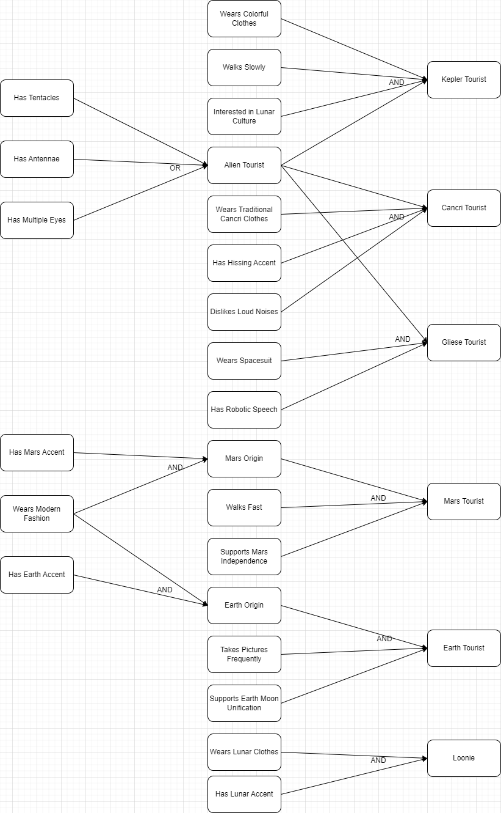

# Lab 1: Expert Systems

## Performed by: Zlatovcen Bogdan, group FAF-212

## Verified by: Elena Graur, asist. univ.

### Task 1: Define Tourist Types and Draw the Goal Tree



### Task 2: Implement the Rules from the Goal Tree

The set of rules:

```python
TOURIST_RULES = [
    # Earth-origin tourist
    IF(AND(Features.wears_traditional_earth_clothes,
           Features.has_earth_accent),
       THEN(EarthOriginTourist.conclusion)),

    # Mars-origin tourist
    IF(AND(Features.wears_modern_fashion,
           Features.has_mars_accent),
       THEN(MarsOriginTourist.conclusion)),

    # Alien tourist based on physical features
    IF(Features.has_antennae,
       THEN(AlienTourist.conclusion)),

    IF(Features.has_tentacles,
       THEN(AlienTourist.conclusion)),

    IF(Features.has_multiple_eyes,
       THEN(AlienTourist.conclusion)),

    # Loonie (local inhabitant)
    IF(AND(Features.wears_lunar_clothes,
           Features.has_lunar_accent),
       THEN(Loonie.conclusion)),

    # Earth Tourist
    IF(AND(EarthOriginTourist.conclusion,
           Features.takes_pictures_frequently,
           Features.supports_earth_moon_unification),
       THEN(EarthTourist.conclusion)),

    # Mars Tourist
    IF(AND(MarsOriginTourist.conclusion,
           Features.walks_fast,
           Features.supports_mars_independence),
       THEN(MarsTourist.conclusion)),

    # Gliese Tourist
    IF(AND(AlienTourist.conclusion,
           Features.wears_spacesuit,
           Features.has_robotic_speech,
           Features.has_antennae,
           Features.has_floating_gait),
       THEN(GlieseTourist.conclusion)),

    # Kepler Tourist
    IF(AND(AlienTourist.conclusion,
           Features.wears_colorful_clothes,
           Features.has_tentacles,
           Features.walks_slowly,
           Features.interested_in_lunar_culture),
       THEN(KeplerTourist.conclusion)),

    # Cancri Tourist
    IF(AND(AlienTourist.conclusion,
           Features.wears_traditional_cancri_clothes,
           Features.has_multiple_eyes,
           Features.has_hissing_accent,
           Features.dislikes_loud_noises),
       THEN(CancriTourist.conclusion)),
]
```

### Task 3: Forward Chaining Algorithm

Forward Chaining Function atarts with initial facts and applies rules to infer new facts, adding them to the inferred set until no new facts can be added.:

```python
def forward_chain(rules, data):
    inferred = set(data)
    added = True
    while added:
        added = False
        for rule in rules:
            bindings_list = match_antecedent(rule.antecedent, inferred)
            for bindings in bindings_list:
                for conclusion in rule.consequent:
                    consequent = instantiate_consequent(conclusion, bindings)
                    if consequent not in inferred:
                        inferred.add(consequent)
                        added = True
    return inferred
```

### Task 4: Backward Chaining Algorithm

Backward haining attempts to prove the hypothesis by finding rules that conclude it and recursively proving their antecedents:

```python
def backward_chain(rules, hypothesis, inferred=None):
    if inferred is None:
        inferred = set()
    if hypothesis in inferred:
        return []
    goal_tree = []
    for rule in rules:
        for conclusion in rule.consequent:
            bindings = match(conclusion, hypothesis)
            if bindings is not None:
                antecedent = rule.antecedent
                sub_goals = backward_chain_antecedent(rules, antecedent, bindings, inferred)
                goal_tree.append((rule, sub_goals))
    if not goal_tree:
        inferred.add(hypothesis)
        goal_tree.append((hypothesis, []))
    return goal_tree
```

### Task 5: Generating Questions from the Goal Tree

We transform statements to questions:

```python
    def statement_to_question(self, statement):
        if statement.startswith('wears'):
            return f'Do you {statement}?'
        elif statement.startswith('has'):
            return f'Do you have {statement[4:]}?'
        elif statement.startswith('takes'):
            return f'Do you {statement}?'
        elif statement.startswith('supports'):
            return f'Do you {statement}?'
        elif statement.startswith('dislikes'):
            return f'Do you {statement}?'
        elif statement.startswith('is interested in'):
            return f'Are you interested in {statement[16:]}?'
        elif statement.startswith('walks'):
            return f'Do you {statement}?'
        elif statement.startswith('is'):
            return f'Are you{statement[2:]}?'
        else:
            return f'Do you {statement}?'
```

### Task 6: Interactive Expert System with Dynamic Questioning

User inputs his name, that will then be included in the questions. At the end, the program asks the user if he wants to exit or rerun the program.

```python
  print("Welcome to the Luna-City Tourist Expert System!")
    print("-----------------------------------------------")
    name = input("Please enter your name:\n")
    print(f"Hello, {name}!")
    choices = Choices()
    while True:
        print("Choose the algorithm you want to use:")
        algorithm = input("Enter 1 for Forward Chaining, 2 for Backward Chaining:\n")
        if algorithm == '1':
            choices.forward(name)
        elif algorithm == '2':
            choices.backward(name)
        else:
            print("Invalid choice.")
        continue_choice = input("Do you want to continue? (yes/no)\n")
        if continue_choice.lower() != 'yes':
            print("Goodbye!")
            break

```

### Task 7: Formatting Output and Questions in Human-Readable Format

We transform each statement to a question:

```python
   def statement_to_question(self, statement):
        if statement.startswith('wears'):
            return f'Do you {statement}?'
        elif statement.startswith('has'):
            return f'Do you have {statement[4:]}?'
        elif statement.startswith('takes'):
            return f'Do you {statement}?'
        elif statement.startswith('supports'):
            return f'Do you {statement}?'
        elif statement.startswith('dislikes'):
            return f'Do you {statement}?'
        elif statement.startswith('is interested in'):
            return f'Are you interested in {statement[16:]}?'
        elif statement.startswith('walks'):
            return f'Do you {statement}?'
        elif statement.startswith('is'):
            return f'Are you{statement[2:]}?'
        else:
            return f'Do you {statement}?'
```
